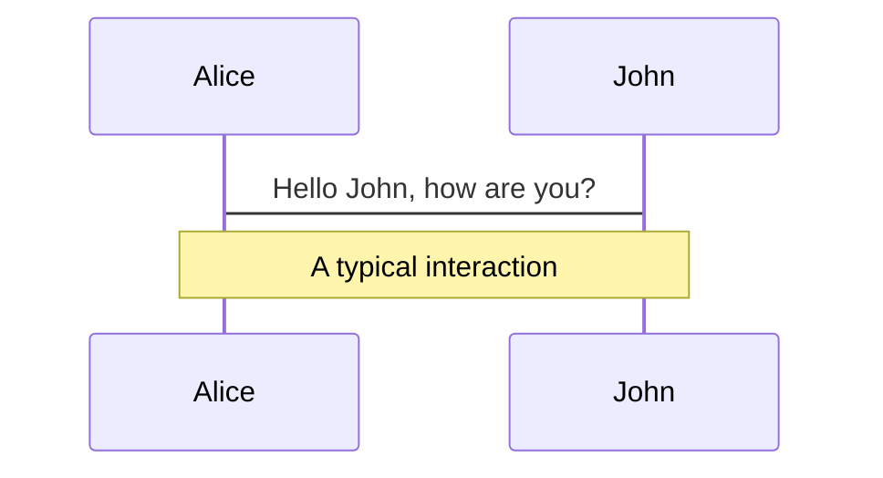
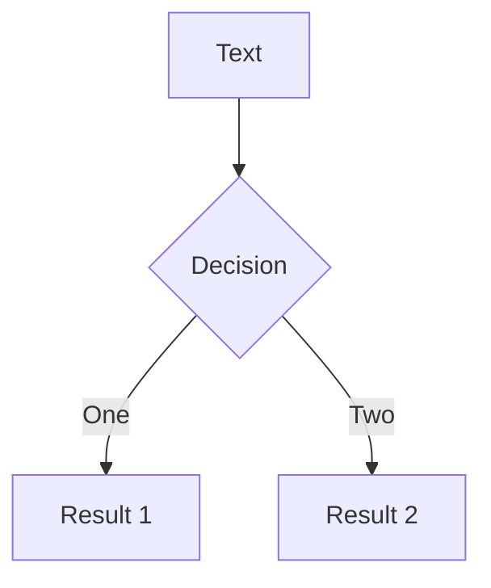
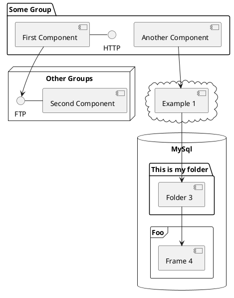

# Staff training and awareness

By [Nayan](https://nayanpatel.net)

<div class="pt-12">
  <span @click="$slidev.nav.next" class="px-2 py-1 rounded cursor-pointer" hover="bg-white bg-opacity-10">
    Next slide... <carbon:arrow-right class="inline"/>
  </span>
</div>

<div class="abs-br m-6 flex gap-2">
  <a href="N/A" target="_blank" alt="GitHub"
    class="text-xl icon-btn opacity-50 !border-none !hover:text-white">
    <carbon-logo-github />
  </a>
</div>

---

# What is a cyber attack? <Description />


Cyber attacks are unwelcome attempts to steal, expose, alter, disable or destroy information through unauthorized access to computer systems. <br>

<div class="grid grid-cols-1">

They can come in many different forms, such as:

- 🚫 **Denial of Service** - Floods the target with illegitimate requests which leads to site downtime.
- 🎣 **Phishing** - Occurs when a hacker sends emails that seem to be coming from trusted sources in an attempt to grab sensitive information.
- 💉 **SQL injection** - A command is injected into a data plane in place of something else that normally goes there, such as a password or login. The server then runs the command and the system is penetrated.
- 💬 **And more...** - There are more cyber attacks out there, these are only some of them!


<br>
<br>

Read more about [cyber attacks](https://notes.nayanpatel.net)

</div>

<style>
h1 {
  background-color: #2B90B6;
  background-image: linear-gradient(45deg, #4EC5D4 10%, #146b8c 20%);
  background-size: 100%;
  -webkit-background-clip: text;
  -moz-background-clip: text;
  -moz-text-fill-color: transparent;
}
</style>

---

# Threats to systems and data <MarkerCore />

If a user falls for a malicious trick, there are many security vulnerabilities that could be at risk. <br>

Here are some system and data threats...

<div class="grid grid-cols-2 gap-x-2"><div>

<div v-click>

### 👷 Social Engineering

- Occurs when an employee inside the company is tricked into revealing information. Employees would be manipulated to give out passwords or other confidential information. 
- Can take the form of attackers impersonating friends or other trusted sources. 

</div>

<div v-click>

### 🦠 Virus

- Designed to copy and attach itself to applications on your computer and spread through server files onto other workstations within the workplace. 
- This can result in a loss of company data. 

</div>


</div><div>

<div v-click>

### 🪱 Worms

- Comes in the form of an email, text, message, they usually contain a suspicious link and when clicked, it'll prompt your for information.
- This can also result in a loss of data and denied access to systems.

</div>

<div v-click>

### 🕵️ Spyware

- Usually comes in the form of a popup and prompts you to install applications or download files
- From there, the application keeps track of your keystrokes, reads and deletes files and has full control over your machine.

</div>
</div></div>


---

# Response to suspected phishing <MarkerPattern />

Step by step guide on how to respond to phishing.

<div v-click>

#### Step 1
##### **Identification**
- The first step in responding to a phishing attack is to identify the sender. 
  - Check the email address of the sender against the intended sender.
- Check the email for suspicious files. 

</div>

<br>
<br>

<div v-click>

#### Step 2
##### **Triage**
- If step one passes, and you discover that this could be an actual phishing attack
  - Try to determine the severity of this attack, then notify the IT department of this. 

</div>

<br>
<br>

<div v-click>

#### Following steps
- The following steps, such as Investigation, Remediation and Risk avoidance will be done by the IT department. 

</div>


<style>

  .slidev-vclick-target {
    -webkit-transition-property: opacity;
    -o-transition-property: opacity;
    transition-property: opacity;
    -webkit-transition-timing-function: cubic-bezier(.4,0,.2,1);
    -o-transition-timing-function: cubic-bezier(.4,0,.2,1);
    transition-timing-function: cubic-bezier(0.4, 0, 0.2, 1);
    -webkit-transition-duration: .15s;
    -o-transition-duration: .15s;
    transition-duration: .15s;
    -webkit-transition-duration: .1s;
    -o-transition-duration: .1s;
    transition-duration: .1s;
    box-shadow: rgb(236 72 153 / 34%) 0px 0px 0px 3px;
    border-radius: 10px;
    padding: 10px;
    background-color: #1b1b1b;
    width: max-content;
  }

</style>
---

# Components

<div grid="~ cols-2 gap-4">
<div>

You can use Vue components directly inside your slides.

We have provided a few built-in components like `<Tweet/>` and `<Youtube/>` that you can use directly. And adding your custom components is also super easy.

```html
<Counter :count="10" />
```

<!-- ./components/Counter.vue -->
<Counter :count="10" m="t-4" />

Check out [the guides](https://sli.dev/builtin/components.html) for more.

</div>
<div>

```html
<Tweet id="1390115482657726468" />
```

<Tweet id="1390115482657726468" scale="0.65" />

</div>
</div>


---
class: px-20
---

# Themes

Slidev comes with powerful theming support. Themes can provide styles, layouts, components, or even configurations for tools. Switching between themes by just **one edit** in your frontmatter:

<div grid="~ cols-2 gap-2" m="-t-2">

```yaml
---
theme: default
---
```

```yaml
---
theme: seriph
---
```


</div>

Read more about [How to use a theme](https://sli.dev/themes/use.html) and
check out the [Awesome Themes Gallery](https://sli.dev/themes/gallery.html).

---
preload: false
---

# Animations

Animations are powered by [@vueuse/motion](https://motion.vueuse.org/).

```html
<div
  v-motion
  :initial="{ x: -80 }"
  :enter="{ x: 0 }">
  Slidev
</div>
```

<div class="w-60 relative mt-6">
  <div class="relative w-40 h-40">
    
    
    
  </div>

  <div
    class="text-5xl absolute top-14 left-40 text-[#2B90B6] -z-1"
    v-motion
    :initial="{ x: -80, opacity: 0}"
    :enter="{ x: 0, opacity: 1, transition: { delay: 2000, duration: 1000 } }">
    Slidev
  </div>
</div>

<!-- vue script setup scripts can be directly used in markdown, and will only affects current page -->
<script setup lang="ts">
const final = {
  x: 0,
  y: 0,
  rotate: 0,
  scale: 1,
  transition: {
    type: 'spring',
    damping: 10,
    stiffness: 20,
    mass: 2
  }
}
</script>

<div
  v-motion
  :initial="{ x:35, y: 40, opacity: 0}"
  :enter="{ y: 0, opacity: 1, transition: { delay: 3500 } }">

[Learn More](https://sli.dev/guide/animations.html#motion)

</div>

---

# LaTeX

LaTeX is supported out-of-box powered by [KaTeX](https://katex.org/).

<br>

Inline $\sqrt{3x-1}+(1+x)^2$

Block
$$
\begin{array}{c}

\nabla \times \vec{\mathbf{B}} -\, \frac1c\, \frac{\partial\vec{\mathbf{E}}}{\partial t} &
= \frac{4\pi}{c}\vec{\mathbf{j}}    \nabla \cdot \vec{\mathbf{E}} & = 4 \pi \rho \\

\nabla \times \vec{\mathbf{E}}\, +\, \frac1c\, \frac{\partial\vec{\mathbf{B}}}{\partial t} & = \vec{\mathbf{0}} \\

\nabla \cdot \vec{\mathbf{B}} & = 0

\end{array}
$$

<br>

[Learn more](https://sli.dev/guide/syntax#latex)

---

# Diagrams

You can create diagrams / graphs from textual descriptions, directly in your Markdown.

<div class="grid grid-cols-3 gap-10 pt-4 -mb-6">







</div>

[Learn More](https://sli.dev/guide/syntax.html#diagrams)


---
layout: center
class: text-center
---

# Learn More

[Documentations](https://sli.dev) · [GitHub](https://github.com/slidevjs/slidev) · [Showcases](https://sli.dev/showcases.html)
